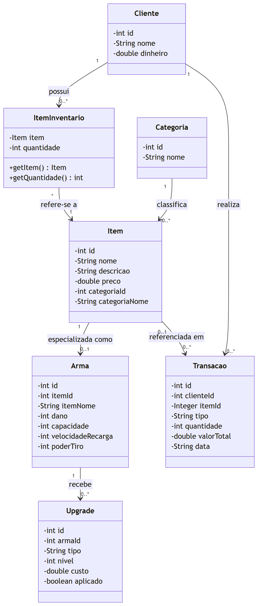
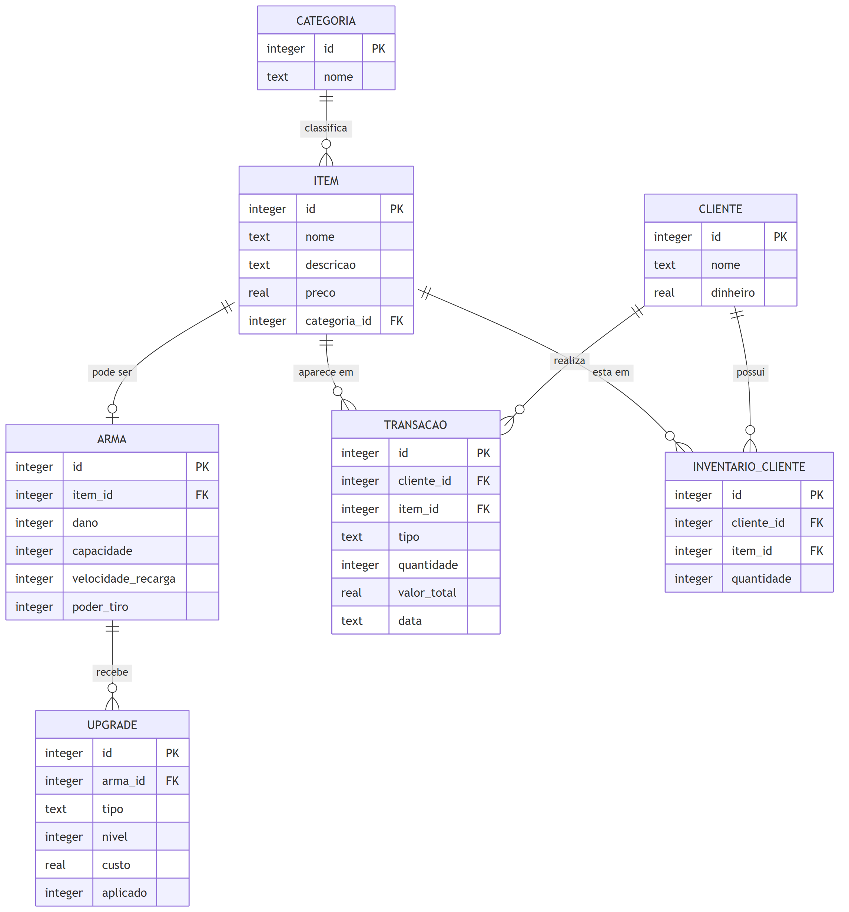

# Diagramas do Mercador

Diagrama de classes e diagrama Entidade-Relacionamento (MER), gerados a partir das entidades implementadas em `src/mercador/model` e das tabelas criadas em `mercador.database.ConexaoSQLite`.

| Arquivo | O que é |
|---|---|
| [`diagrama-classes.png`](diagrama-classes.png) · [`.svg`](diagrama-classes.svg) | Diagrama de classes — PNG em alta resolução e SVG vetorial (não perde qualidade ao ampliar) |
| [`diagrama-er.png`](diagrama-er.png) · [`.svg`](diagrama-er.svg) | Diagrama ER (MER) — PNG em alta resolução e SVG vetorial |
| [`diagrama-classes.mmd`](diagrama-classes.mmd) · [`diagrama-er.mmd`](diagrama-er.mmd) | Código-fonte (Mermaid) de cada diagrama, para editar e gerar as imagens de novo |

## Diagrama de classes

Reflete as 7 classes de modelo do projeto e como elas se referenciam entre si em memória (por id, sem navegação de objeto direta, exceto `ItemInventario`).

- `Item` é a entidade genérica do catálogo; `Arma` é uma especialização opcional — só existe quando o item é uma arma (relação 1 para 0..1).
- `Upgrade` pertence sempre a uma `Arma`, nunca a um item genérico. `aplicado` indica se o upgrade já foi comprado.
- `Transacao` aponta para o `Cliente` que operou e, opcionalmente, para o `Item` envolvido (`itemId` é `Integer`, aceita nulo).
- `ItemInventario` é um objeto de leitura (item + quantidade) montado a partir da tabela `inventario_cliente`.

## Diagrama ER (MER)

Baseado nas 7 tabelas e chaves estrangeiras definidas em `ConexaoSQLite.criarTabelas`.

- `item.categoria_id` é **NOT NULL** — todo item precisa de categoria (1 categoria → 0..N itens).
- `arma.item_id` é 1 para 1 opcional: nem todo item tem uma linha em `arma`, mas toda arma referencia exatamente um item.
- `inventario_cliente` guarda o que o cliente possui; tem `UNIQUE (cliente_id, item_id)`, então cada item aparece uma vez por cliente, com a quantidade.
- `upgrade.aplicado` é `INTEGER` (0/1), default 0.
- `upgrade.arma_id` e `transacao.cliente_id` são **NOT NULL**; `transacao.item_id` é a única FK que aceita nulo no schema atual.

## Como atualizar os diagramas

Se o modelo ou o banco mudar, edite o `.mmd` correspondente e gere as imagens de novo:

1. Abra [mermaid.live](https://mermaid.live) e cole o conteúdo do arquivo `.mmd` (ou use [draw.io](https://app.diagrams.net): Extras → Edit Diagram → cola o conteúdo Mermaid).
2. Exporte em **PNG** e em **SVG**.
3. Substitua `diagrama-classes.png/.svg` ou `diagrama-er.png/.svg` nesta pasta, mantendo os mesmos nomes — assim os READMEs continuam mostrando a imagem nova.
