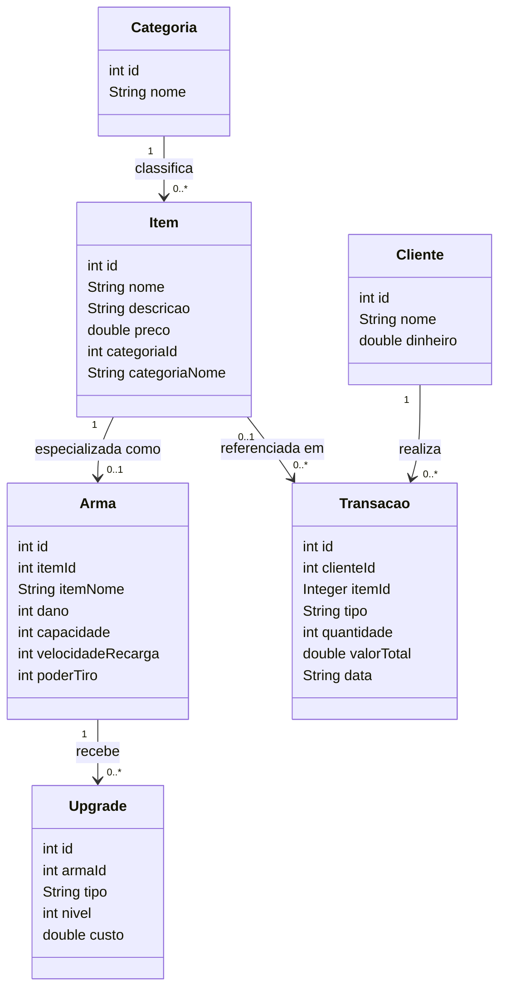
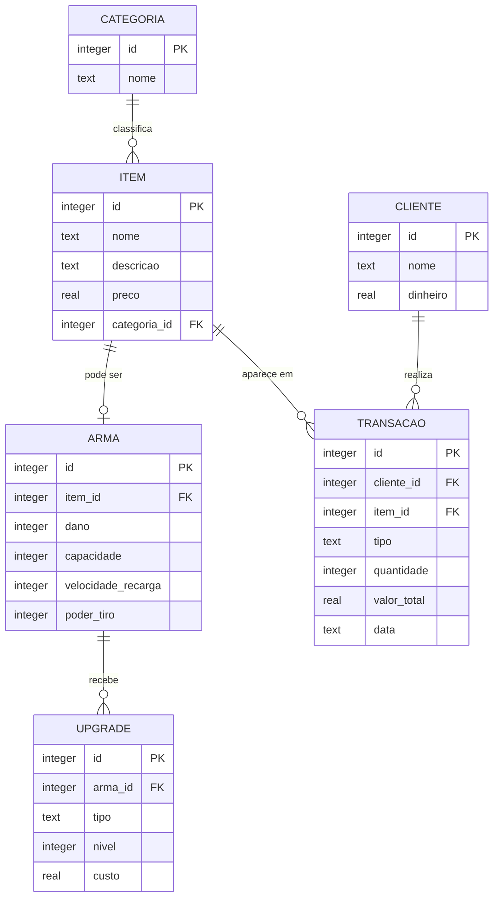

# Diagramas do Mercador

Diagrama de classes e diagrama Entidade-Relacionamento (MER), gerados a partir das entidades implementadas em `src/mercador/model` e das tabelas criadas em `mercador.database.ConexaoSQLite`.

Os arquivos-fonte (`.mmd`) estão nesta pasta e podem ser abertos/editados em:
- [mermaid.live](https://mermaid.live) — cola o conteúdo do arquivo e exporta PNG/SVG
- [draw.io](https://app.diagrams.net) — Extras → Edit Diagram → cola o conteúdo Mermaid

## Diagrama de classes

Reflete as 6 classes de modelo do projeto e como elas se referenciam entre si em memória (por id, sem navegação de objeto direta).

- `Item` é a entidade genérica do catálogo; `Arma` é uma especialização opcional — só existe quando o item é uma arma (relação 1 para 0..1).
- `Upgrade` pertence sempre a uma `Arma`, nunca a um item genérico.
- `Transacao` aponta para o `Cliente` que operou e, opcionalmente, para o `Item` envolvido (`itemId` é `Integer`, aceita nulo).

## Diagrama ER (MER)

Baseado nas 6 tabelas e chaves estrangeiras definidas em `ConexaoSQLite.criarTabelas`.

- `item.categoria_id` é **NOT NULL** — todo item precisa de categoria (1 categoria → 0..N itens).
- `arma.item_id` é 1 para 1 opcional: nem todo item tem uma linha em `arma`, mas toda arma referencia exatamente um item.
- `upgrade.arma_id` e `transacao.cliente_id` são **NOT NULL**; `transacao.item_id` é a única FK que aceita nulo no schema atual.

## Gap conhecido

Nenhuma das 6 tabelas guarda o **inventário do cliente** (o que ele já comprou e ainda possui). Hoje isso só existiria de forma derivada, somando/subtraindo linhas de `transacao` — por isso as telas de Vender e Inventário (Maleta) ainda usam o catálogo inteiro como prévia. Ao criar essa tabela (ex.: `inventario_cliente`), os dois diagramas acima precisam ganhar essa 7ª entidade.
